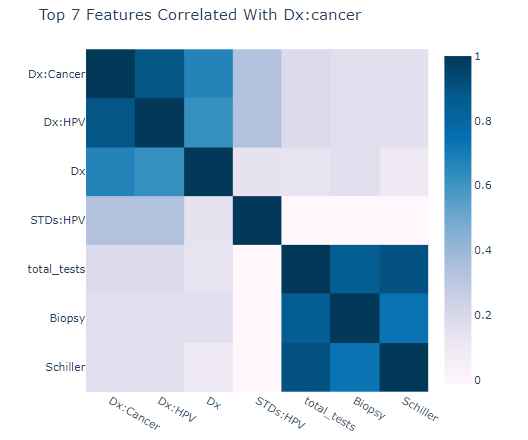

# Cervical Cancer Risk Factors for Biopsy

## Cervical Cancer

by Estela Perez, Angie Bolden, Ramiro Cervantes, Paola Moreno

Although it is the most preventable type of cancer, each year cervical cancer kills about 4,000 
women in the U.S. and about 300,000 women worldwide. In the United States, however, cervical
cancer mortality rates plunged by 74% from 1955 - 1992 thanks to increased screening and early 
detection with the Pap test.

## LOGISTICAL REGRESSION

Our model incorporates the following indicators to classify whether a patient is at-risk and 
should undergo a biopsy for cervical cancer. 

### High Sexual Activity

Human papilloma virus (HPV) is the main risk factor for cervical cancer. In adults, the most 
important risk factor for HPV is sexual activity with an infected person. Women most at risk for 
cervical cancer are those with a history of multiple sexual partners, sexual intercourse at age 17 
years or younger, or both. 

### Family History

Women have a higher risk of cervical cancer if they have a first-degree relative (mother, sister) 
who has had cervical cancer. 

### Use Of Oral Contraceptives

Studies have reported a strong association between cervical cancer and long-term use of oral 
contraception (OC). Women who take birth control pills for more than 5 - 10 years appear to 
have a much higher risk HPV infection (up to four times higher) than those who do not use OCs. 
Some research also suggests that the hormones in OCs might help the virus enter the genetic 
material of cervical cells. 

### Smoking

Smoking is associated with a higher risk for precancerous changes (dysplasia) in the cervix and 
for progression to invasive cervical cancer, especially for women infected with HPV. 

### CONCLUSION

With a Training Score of 0.93820 and a Testing Score: 0.98315, our model demonstrates 
meaningful predictive power in the cervical cancer screening process. 

SOURCE: UCI Machine Learning Repository

https://archive.ics.uci.edu/ml/datasets/Cervical+cancer+%28Risk+Factors%29#
ORIGINAL SOURCE: Kelwin Fernandes, Jaime S. Cardoso, and Jessica Fernandes. 'Transfer Learning with 
Partial Observability Applied to Cervical Cancer Screening.' Iberian Conference on Pattern Recognition and 
Image Analysis. Springer International Publishing, 2017.

DISCLAIMER: The dataset was collected at 'Hospital Universitario de Caracas' in Caracas, Venezuela. The 
dataset comprises demographic information, habits, and historic medical records of 858 patients. Several 
patients decided not to answer some of the questions because of privacy concerns (missing values).
